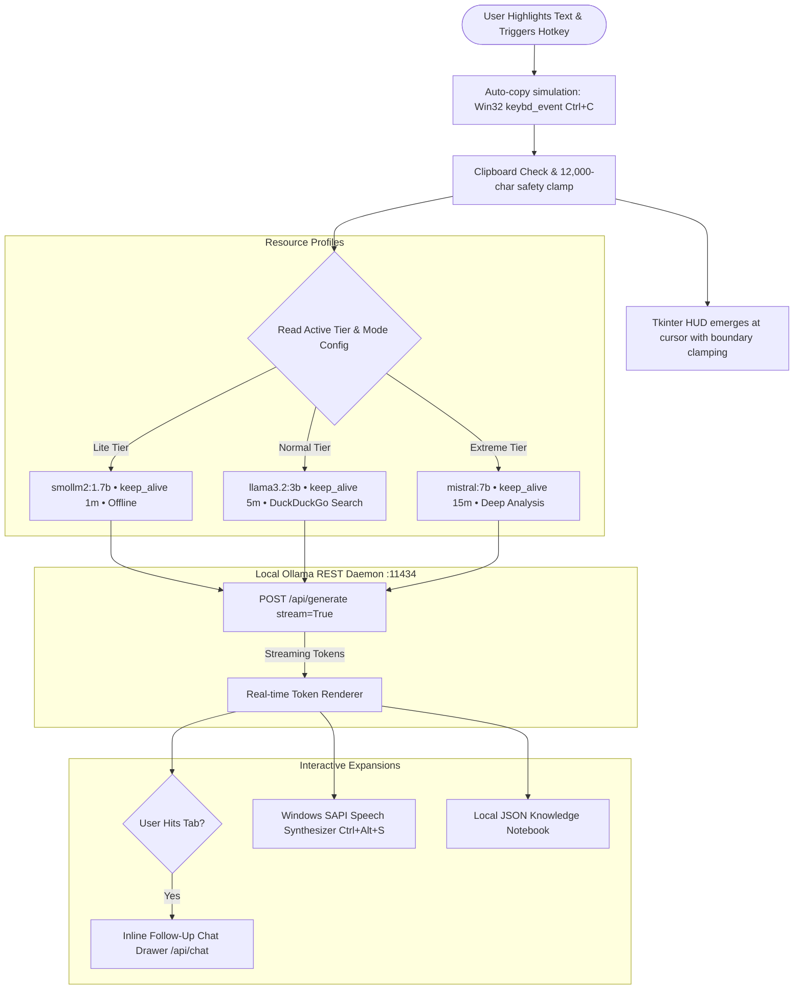

# wat-this

A lightweight, cursor-anchored desktop ambient copilot powered by local LLMs (via Ollama) and a Zero-DLL Tkinter HUD. Highlight any text or code snippet, trigger a specialized hotkey, and an ambient HUD appears beside your cursor with plain-English explanations, bug fixes, or simplified breakdowns.

<p align="center">
  
</p>

---

## Overview

`wat-this` is an ambient, distraction-free reading and coding copilot for Windows 10 & 11. Fully compliant with **Windows Smart App Control (SAC)** and **WDAC** via a zero-DLL, signed standard library design.

1. **Highlight text or code** in any browser, IDE, or document.
2. **Press a specialized hotkey**:
   - `Ctrl + Alt + Space`: **Explain Mode** (Plain English + real-world analogy).
   - `Ctrl + Alt + F`: **Fix Mode** (Detects bugs and provides corrected code).
   - `Ctrl + Alt + T`: **Simplify Mode** (Rewrites jargon for a beginner / ELI5).
   - `Ctrl + Alt + D`: **Docstring Mode** (Generates clean docs and type hints).
   - `Ctrl + Alt + S`: **Listen (TTS)** (Speaks output aloud via offline Windows SAPI).
3. **Ask follow-up questions inline**: Hit `Tab` to expand an interactive chat input right on the card.
4. **Knowledge Notebook**: All queries and answers are recorded locally and can be exported to Markdown for Obsidian or Notion.

---

## Multi-Action Modes & Hotkeys

| Mode | Hotkey | Required Tier | Capabilities |
| :--- | :--- | :--- | :--- |
| **Explain & Teach** | `Ctrl + Alt + Space` | **Lite+** | Plain-language concepts, code analogies, DuckDuckGo web enrichment. |
| **Simplify (ELI5)** | `Ctrl + Alt + T` | **Lite+** | Elementary-level simplification for dense academic or legal text. |
| **Fix & Bug Detector** | `Ctrl + Alt + F` | **Normal+** | Syntactic and logic bug analysis with instant copyable patch. |
| **Generate Docstrings** | `Ctrl + Alt + D` | **Extreme** | Clean, standardized function documentation & type annotations. |
| **Offline Audio TTS** | `Ctrl + Alt + S` | **Normal+** | Offline voice readout powered by Windows `System.Speech`. |

---

## Memory & Performance Tiers

`wat-this` strictly enforces RAM budgets and feature level gating, dynamically releasing model weights back to the OS when idle (`keep_alive` timeouts) to avoid memory hoarding.

| Tier | Target RAM | Model & Family | Unlocked Modes | Interactive Chat | Offline TTS | Web Context | Keep-Alive |
|---|---|---|---|---|---|---|---|
| **Lite** | `< 2 GB` | `smollm2:1.7b` *(Hugging Face)* | Explain, Simplify | Locked | Locked | Disabled (100% Offline) | `1m` unload |
| **Normal** | `3 – 5 GB` | `llama3.2:3b` *(Meta)* | Explain, Simplify, Fix | 2-Turn Follow-up | Enabled | DuckDuckGo Search | `5m` cache |
| **Extreme** | `6 – 10 GB` | `mistral:7b` *(Mistral AI)* | All 4 Modes (+Docstrings) | Unlimited Multi-turn | Enabled | Deep Web Search | `15m` session cache |

---

## Architecture & Data Flow



---

## Clean Project Structure

```
wat-this/
├── SETUP.bat           <-- The One-Click Setup & Launcher
├── README.md           <-- Documentation
├── HowTo.md            <-- Step-by-Step Guide
├── assets/             <-- Custom App Icons (.png & .ico)
└── src/                <-- Consolidated Engine, UI & Configuration
    ├── wat_this.py         Main Ambient Agent (Tkinter Zero-DLL)
    ├── setup.py            Setup & Maintenance GUI Wizard
    ├── config_manager.py   Configuration & Tier Manager
    ├── history_manager.py  Knowledge Notebook & Markdown Exporter
    ├── tts_helper.py       Windows SAPI Text-to-Speech Engine
    ├── search_helper.py    Pure-Python Web Search Engine
    └── config.json         Active Tier & Performance Settings
```


---

## Tech Stack & Compatibility

- **Zero-DLL Architecture**: Built using Python 3.12 standard libraries and pure-Python modules (`tkinter`, `urllib`, `requests`, `pyperclip`, `keyboard`), fully compliant with **Windows 11 Smart App Control (SAC)** and **Windows Defender Application Control (WDAC)**.
- **Local Inference**: Ollama REST API (`smollm2:1.7b`, `llama3.2:3b`, `mistral:7b`)
- **Global Input**: `keyboard` OS hook + Win32 `ctypes` simulation
- **Web Context**: Pure-Python DuckDuckGo API integration (`search_helper.py`)
- **Configuration**: Local JSON storage (`src/config.json`) managed by `src/config_manager.py`

---

## Quick Reference

| Action | Command / Shortcut |
|---|---|
| **One-Click Setup** | Double-click **`SETUP.bat`** |
| **Launch Assistant** | Click **"Launch wat-this"** inside Setup, or run `pythonw src/wat_this.py` |
| **Trigger Explainer** | `Ctrl + Alt + Space` |
| **Dismiss Card** | `Escape` or click anywhere on the card |

For step-by-step instructions, see [HowTo.md](file:///c:/Users/jishn/Documents/project/wat-this/HowTo.md).
