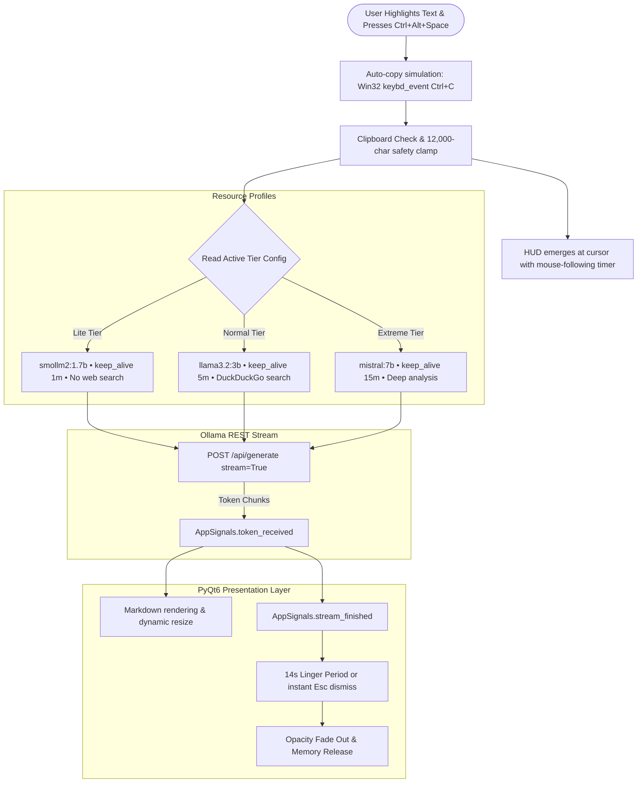

# wat-this

A lightweight, cursor-anchored desktop explainer powered by local LLMs (via Ollama) and PyQt6. Highlight any text or code snippet, trigger the global hotkey, and an ambient HUD appears beside your cursor with a plain-English explanation.

<p align="center">
  
</p>

---

## Overview

`wat-this` is an ambient, distraction-free reading and coding copilot for Windows. Rather than context-switching away from your active work:

1. **Highlight text or code** in any application.
2. **Press `Ctrl + Alt + Space`** (auto-copies selection).
3. **Read the explanation** streamed directly beside your cursor in a floating dark-mode card.
4. **Dismiss effortlessly** via `Esc`, clicking the card, or letting the 14-second timer smoothly fade it away.

The system includes a dedicated **Setup & Maintenance Wizard** (`wat_this_setup.py`) that handles Ollama diagnostics, downloads models with live progress bars, configures hotkeys, and cleanly deletes models when you need to free up disk space.

---

## Memory & Performance Tiers

`wat-this` enforces strict RAM budgets and resource management, dynamically releasing model weights back to the OS when idle (`keep_alive` timeouts) to avoid VRAM hoarding.

| Tier | Target RAM | Model & Family | Context Length | Web Context | Best For |
|---|---|---|---|---|---|
| **Lite** | `< 2 GB` | `smollm2:1.7b` *(Hugging Face)* | 2,048 tokens | Disabled (Offline) | Ultra-low memory, on-device efficiency, zero network latency |
| **Normal** | `3 – 5 GB` | `llama3.2:3b` *(Meta)* | 4,096 tokens | DuckDuckGo Search | Everyday coding, code analogies, live web context *(Recommended)* |
| **Extreme** | `6 – 10 GB` | `mistral:7b` *(Mistral AI)* | 8,192 tokens | DuckDuckGo Search | Deep technical breakdowns, edge-case detection, architectural synthesis |

---

## Architecture & Data Flow



---

## Setup & Maintenance Wizard

`wat-this` features a **single one-click setup file** right at the root of the project:

- Simply **double-click `SETUP.bat`**.

All complex scripts, configuration files, and engines are cleanly tucked inside `src/`. `SETUP.bat` automatically verifies your environment and opens the Setup & Maintenance Wizard:

1. **Engine Diagnostics**: Confirms Ollama daemon health (`/api/version`), Python 3.12 status, and available physical system RAM.
2. **Model Tiers & Installer**: Visual cards for Lite, Normal, and Extreme tiers. Includes an **Install / Pull** button that streams live download progress from Ollama (`/api/pull`) with real-time percentage and byte tracking.
3. **Preferences**: Configure custom hotkeys, toggle auto-copy simulation, and tune HUD display duration.
4. **Uninstall & Cleanup**: Inspects downloaded models and their exact disk footprint. Provides one-click deletion (`DELETE /api/delete`) to reclaim gigabytes of disk space, or restores default settings.

---

## Clean Project Structure

```
wat-this/
├── SETUP.bat           <-- The One-Click Setup & Launcher
├── README.md           <-- Documentation
├── HowTo.md            <-- Step-by-Step Guide
├── assets/             <-- Custom App Icons (.png & .ico)
└── src/                <-- Consolidated Engine, UI & Configuration
    ├── wat_this.py         Main Ambient Agent (Tkinter Zero-DLL)
    ├── setup.py            Setup & Maintenance GUI Wizard
    ├── config_manager.py   Configuration & Tier Manager
    ├── search_helper.py    Pure-Python Web Search Engine
    ├── config.json         Active Tier & Performance Settings
    └── LucidApp.py         Backward-compatibility Forwarder
```

---

## Tech Stack & Compatibility

- **Zero-DLL Architecture**: Built using Python 3.12 standard libraries and pure-Python modules (`tkinter`, `urllib`, `requests`, `pyperclip`, `keyboard`), fully compliant with **Windows 11 Smart App Control (SAC)** and **Windows Defender Application Control (WDAC)**.
- **Local Inference**: Ollama REST API (`smollm2:1.7b`, `llama3.2:3b`, `mistral:7b`)
- **Global Input**: `keyboard` OS hook + Win32 `ctypes` simulation
- **Web Context**: Pure-Python DuckDuckGo API integration (`search_helper.py`)
- **Configuration**: Local JSON storage (`src/config.json`) managed by `src/config_manager.py`

---

## Quick Reference

| Action | Command / Shortcut |
|---|---|
| **One-Click Setup** | Double-click **`SETUP.bat`** |
| **Launch Assistant** | Click **"Launch wat-this"** inside Setup, or run `pythonw src/wat_this.py` |
| **Trigger Explainer** | `Ctrl + Alt + Space` |
| **Dismiss Card** | `Escape` or click anywhere on the card |

For step-by-step instructions, see [HowTo.md](file:///c:/Users/jishn/Documents/project/wat-this/HowTo.md).
