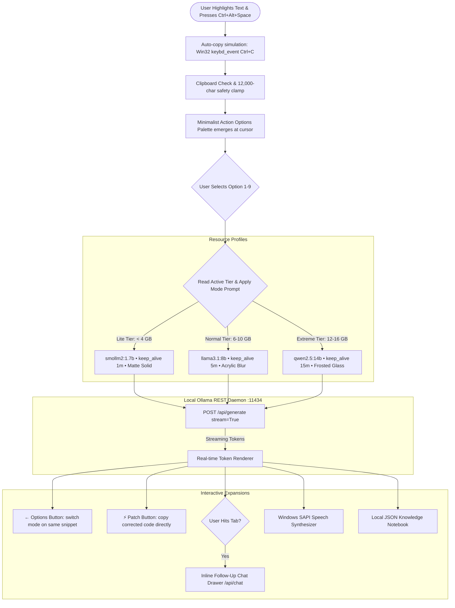

# wat-this

A lightweight, cursor-anchored desktop ambient copilot powered by local LLMs (via Ollama) and a Zero-DLL Tkinter HUD. Highlight any text or code snippet, press **`Ctrl + Alt + Space`**, and an aesthetic command palette pops up right at your cursor with instant options for explanation, translation, bug fixing, terminal breakdown, and deep reasoning.

<p align="center">
  
</p>

---

## Overview

`wat-this` is an ambient, distraction-free reading and coding copilot for Windows 10 & 11. Fully compliant with **Windows Smart App Control (SAC)** and **WDAC** via a zero-DLL, signed standard library design.

1. **Highlight text or code**, or simply trigger on your active window to inspect the entire screen.
2. **Press `Ctrl + Alt + Space`**:
   - A sleek, minimalist **Action Options Palette** emerges immediately at your cursor with snippet preview or active window context.
3. **Interactive Hover Summaries**:
   - Hover over any button or navigate with **`↑` / `↓`** arrows to see an instant summary of what the mode does, capability tags, and tier gating.
4. **Choose an action**:
   - Press **`1`** through **`9`** directly on your keyboard, navigate with **`↑` / `↓`** + **`Enter`**, or click with your mouse.
5. **Interactive Response HUD & On-Screen Visual Guide**:
   - Streams answers with markdown rendering.
   - Click **`📍 Guide`** to toggle a transparent on-screen spotlight bounding box and step guide pin (`❶`) over the target code on your desktop.
   - Click **`← Options`** to try another action on the same snippet.
   - Click **`⚡ Patch`** in Fix mode to copy corrected code.
   - Hit **`Tab`** to expand inline follow-up chat.
6. **Knowledge Notebook**: All queries and answers are recorded locally and can be exported to Markdown for Obsidian or Notion.

---

## Universal Command Palette & Options

All functionality is accessible through the single universal shortcut **`Ctrl + Alt + Space`**:

| Key | Option | Required Tier | Capabilities |
| :---: | :--- | :--- | :--- |
| **`1`** | **Explain & Teach** | **Lite+** | Plain-language concepts, code analogies, DuckDuckGo web enrichment. |
| **`2`** | **Fix Code** | **Lite+** | Syntactic/logic bug analysis with instant 1-click copyable patch. |
| **`3`** | **Simplify (ELI5)** | **Lite+** | Elementary-level simplification for dense academic or legal text. |
| **`4`** | **Quick Translate** | **Lite+** | Direct, contextual translation of foreign language text into English. |
| **`5`** | **Regex & Shell** | **Lite+** | Deconstructs regular expressions or CLI commands step-by-step. |
| **`6`** | **Polish Prose** | **Normal+** | Refines grammar, punctuation, and executive professional tone. |
| **`7`** | **Docstrings & Types** | **Extreme** | Standardized function docstrings and type annotations. |
| **`8`** | **Security Audit** | **Extreme** | Analyzes vulnerabilities, leaks, race conditions, and Big-O complexity. |
| **`9`** | **Unit Test Generator** | **Extreme** | Synthesizes robust, production-grade test suites with mocks. |

---

## Memory & Performance Tiers

`wat-this` strictly enforces RAM budgets and feature level gating, dynamically releasing model weights back to the OS when idle (`keep_alive` timeouts) to avoid memory hoarding. Visual styling and rendering performance are dynamically tuned per active tier.

| Tier | Target RAM | Recommended Model | Unlocked Options | Interactive Chat | Offline TTS | Visual Aesthetic & Optimization | Keep-Alive |
|---|---|---|---|---|---|---|---|
| **Lite** | `< 4 GB` | `smollm2:1.7b` | Options 1–6 | Locked | Locked | Modern 600px rounded dark squircle card, 0.98 opacity, zero blur overhead | `1m` unload |
| **Normal** | `6 – 10 GB` | `llama3.1:8b` *(or 3.2:3b)* | Options 1–6, 8, 9 | 2-Turn Follow-up | Enabled | Modern 640px rounded card, hardware-accelerated Acrylic frosted blur, 0.94 opacity | `5m` cache |
| **Extreme** | `12 – 16 GB` | `qwen2.5:14b` *(or 3.1:8b)* | All 9 Options | Unlimited Multi-turn | Enabled | Modern 680px rounded card, frosted glass with violet ambient aura, 0.94 opacity | `15m` cache |

---

## Fluent UI & Smooth Animation System

All interfaces across `wat-this` have been revamped with native Windows 11 Fluent aesthetics, micro-interactions, and 60 FPS animation loops without third-party binary frameworks:

- **HUD Alpha Fade Transitions**: The cursor HUD eases smoothly into view (`0.0 -> 0.92`) on invocation and fades out softly on dismiss via non-blocking 16ms event loops, eliminating abrupt pop-in flashes.
- **Windows 11 DWM Corner Rounding**: Native DWM attributes (`DWMWA_WINDOW_CORNER_PREFERENCE = 33`, `DWMWCP_ROUND = 2`) with immersive dark mode (`DWMWA_USE_IMMERSIVE_DARK_MODE = 20`) and subtle frosted border styling (`0x0033281E`).
- **Setup Wizard Dynamic Interactions**:
  - **Animated Toggle Switches**: Features tactile pill-shaped sliders with exponential-decay thumb interpolation (`diff * 0.42`) across frames.
  - **Page Entrance Easing**: Switching navigation tabs smoothly animates content into place with micro-vertical easing.
  - **Asynchronous Diagnostic Scanner**: Real-time scanning glyph ticker (`⠋ ⠙ ⠹ ⠸ ⠼ ⠴ ⠦ ⠧ ⠇ ⠏`) verifies background Ollama engine health without freezing the UI.
- **On-Screen Annotation Radar Pulse**: The annotation overlay renders a breathing radar spotlight using sinusoidal glow oscillation (`math.sin(phase) * 3.5`) around the user's targeted code or window region.

---

## Architecture & Data Flow



---

## Clean Project Structure

```
wat-this/
├── RUN_APP.bat         <-- One-Click Ambient Copilot Launcher
├── SETUP.bat           <-- Setup & Configuration Wizard Launcher
├── README.md           <-- Documentation
├── HowTo.md            <-- Step-by-Step Guide
├── assets/             <-- Custom App Icons (.png & .ico)
└── src/                <-- Consolidated Engine, UI & Configuration
    ├── wat_this.py         Main Ambient Agent (Tkinter Zero-DLL, Fluent HUD)
    ├── screen_context.py   Active Window & Full-Screen OCR Context Engine
    ├── annotation_overlay.py Click-Through On-Screen Visual Guide Layer
    ├── setup.py            Setup & Maintenance GUI Wizard
    ├── config_manager.py   Configuration & Tier Manager
    ├── history_manager.py  Knowledge Notebook & Markdown Exporter
    ├── tts_helper.py       Windows SAPI Text-to-Speech Engine
    ├── search_helper.py    Pure-Python Web Search Engine
    └── config.json         Active Tier & Performance Settings
```

---

## Tech Stack & Compatibility

- **Zero-DLL Architecture**: Built using Python 3.12 standard libraries and pure-Python modules (`tkinter`, `urllib`, `requests`, `pyperclip`, `keyboard`), fully compliant with **Windows 11 Smart App Control (SAC)** and **Windows Defender Application Control (WDAC)**.
- **Local Inference**: Ollama REST API (`smollm2:1.7b`, `llama3.1:8b`, `llama3.2:3b`, `qwen2.5:14b`).
- **Global Input**: Universal Win32 RegisterHotKey listener on `Ctrl + Alt + Space` (`0x4003, 0x20`).
- **Web Context**: Pure-Python DuckDuckGo API integration (`search_helper.py`).
- **Configuration**: Local JSON storage (`src/config.json`) managed by `src/config_manager.py`.

---

## Quick Reference

| Action | Command / Shortcut |
|---|---|
| **One-Click Run** | Double-click **`RUN_APP.bat`** |
| **Setup Wizard** | Double-click **`SETUP.bat`** |
| **Universal Copilot** | **`Ctrl + Alt + Space`** |
| **Select Action Option** | Press **`1`** to **`9`** or use **`↑` / `↓`** + **`Enter`** |
| **Switch Options** | Click **`← Options`** in streaming view |
| **Toggle Pin Lock** | Click **`📌 Pin`** in HUD header to lock indefinitely |
| **On-Screen Visual Guide** | Click **`📍 Guide`** to toggle spotlight & step pins |
| **Copy Fixed Code** | Click **`⚡ Patch`** in Fix view |
| **Follow-Up Chat** | Press **`Tab`** to expand chat drawer |
| **Dismiss Card** | **`Escape`** or click **`✕`** in header |

For step-by-step instructions, see [HowTo.md](file:///c:/Users/jishn/Documents/project/wat-this/HowTo.md).
